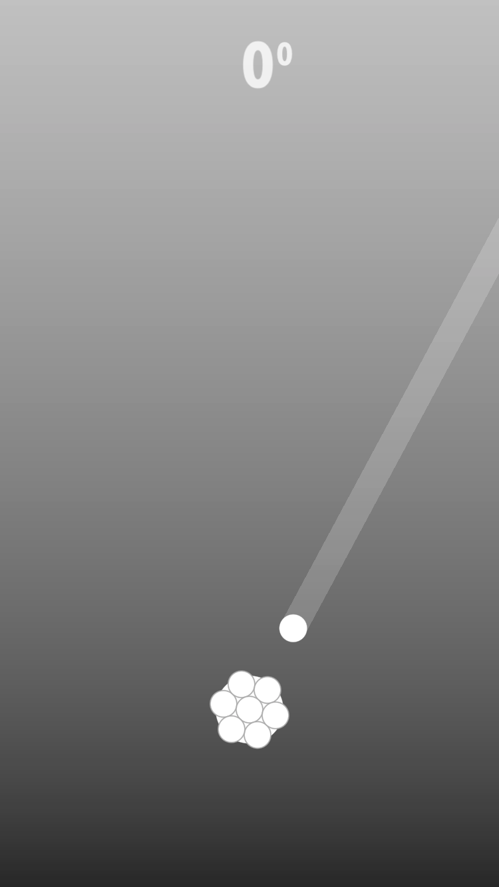

# Atom Attack 1.5
Funny and simple game made in Swift 5.

Your goal is to collect as many Atoms as possible in order to upgrade your Core. Try to avoid Atoms that are different, yet catch as many of the same Atoms as you can.

Enjoy :) 

## License

Originally forked from:
This project is licensed under the MIT License - see the [LICENSE](LICENSE) file for details
